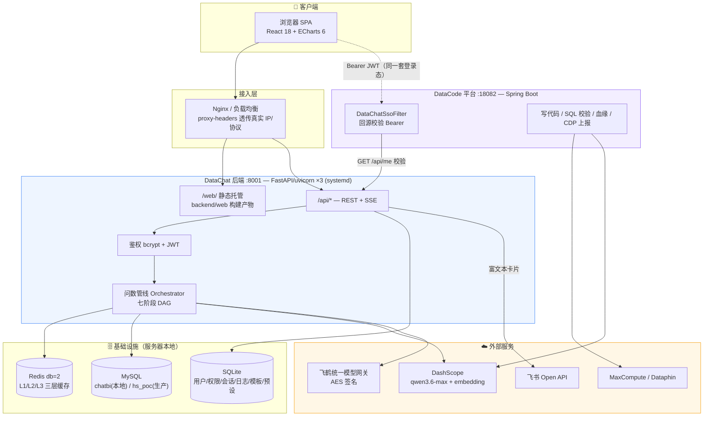
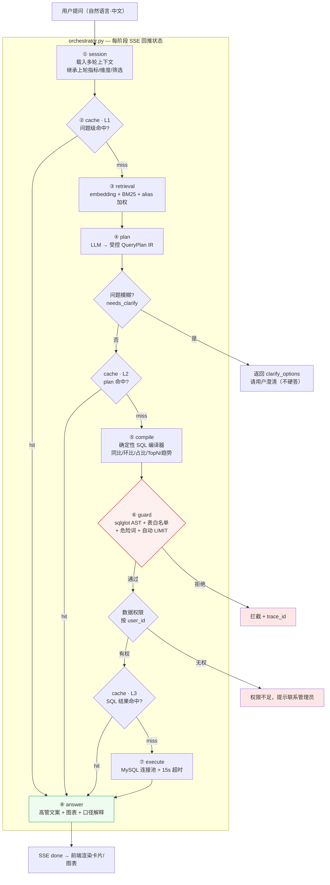
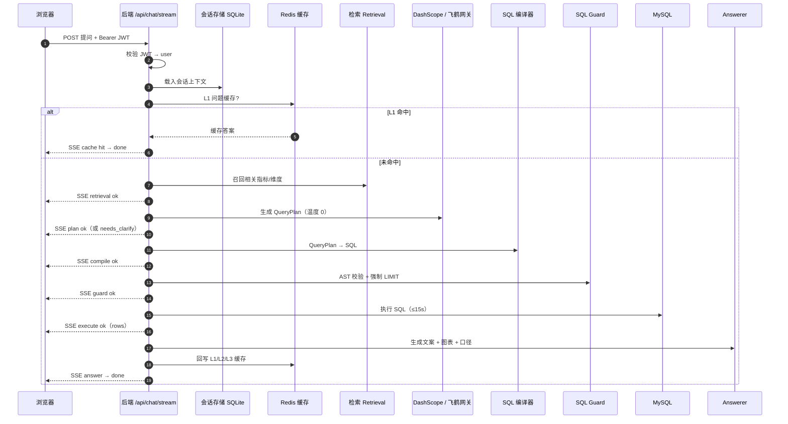
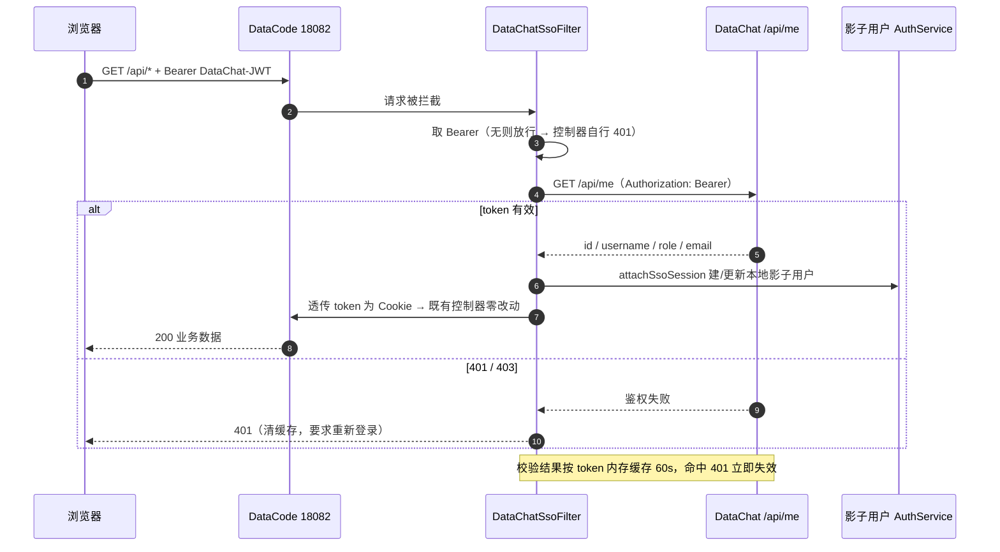
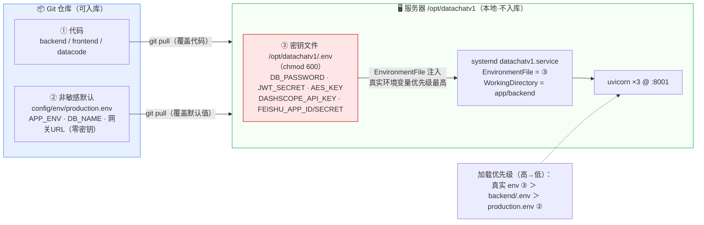
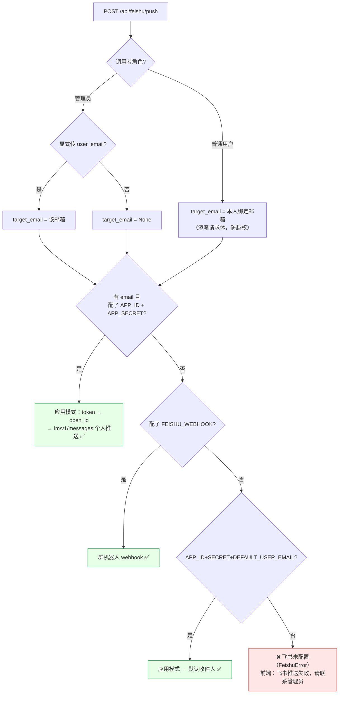

# DataChat · 飞鹤小Q 技术架构图

> 本文用 [Mermaid](https://mermaid.js.org/) 绘制，GitHub / VS Code / IntelliJ 的 Markdown 预览可直接渲染成图。
> 涵盖 6 张视图：①系统总览 ②七阶段问数管线 ③问数请求时序 ④SSO 鉴权流程 ⑤配置分层与部署边界 ⑥飞书推送路由。

---

## ① 系统总览（容器视图）

三个子系统（DataChat 后端 / 前端 SPA / DataCode 平台）+ 基础设施 + 外部服务，靠**统一登录（SSO）**串联。

| 子系统 | 技术栈 | 端口 | 进程/部署 |
|--------|--------|------|-----------|
| DataChat 后端 | Python 3.11 · FastAPI · uvicorn | 8001 | systemd `datachatv1.service`，3 workers |
| DataChat 前端 | React 18 · Vite · TS · Tailwind | — | 构建进 `backend/web/`，由后端托管 |
| DataCode 平台 | Java 8 · Spring Boot · OkHttp | 18082 | 独立服务，复用 DataChat JWT |

---

## ② 七阶段问数管线（核心流程）

一次问数是一条 DAG，逐阶段通过 SSE 实时回推前端。三层缓存任一命中即短路返回。

---

## ③ 问数请求时序（SSE 流式）

---

## ④ SSO 鉴权流程（DataChat ↔ DataCode）

DataChat 是唯一鉴权中心；DataCode 不维护独立账号，凭 DataChat 的 JWT 单点登录。

---

## ⑤ 配置分层与部署边界（密钥永不入库 / 不被覆盖）

Git 只承载前两层（代码 + 零密钥默认值）；所有密钥只在服务器本地第三层，`git pull` 部署不覆盖、优先级最高。

> 🔴 红线：密钥只能进第③层；第②层 `production.env` 会被部署覆盖且入库，**严禁写任何密钥**。

---

## ⑥ 飞书推送路由（按角色 + 配置自动选通道）

解释「飞书推送失败」最常见的两种落点：**未配置** 与 **admin 未选收件人**。

---

## 技术栈一览

| 层 | 选型 |
|----|------|
| 前端 | React 18 · Vite 5 · TypeScript 5 · TailwindCSS 3 · ECharts 6 · framer-motion |
| 后端 | Python 3.11 · FastAPI · uvicorn(多 worker) · Pydantic · httpx · sqlglot · PyMySQL · bcrypt · PyJWT |
| 检索/NL2SQL | DashScope embedding(text-embedding-v3) · BM25 · Plan-First IR · 确定性 SQL 编译器 |
| 存储 | MySQL 8（业务库）· Redis（三层缓存）· SQLite（用户/权限/会话/日志/模板/预设） |
| LLM | 阿里百炼 DashScope（qwen3.6-max-preview）/ 飞鹤统一网关（AES 签名，二选一，可多预设热切换） |
| DataCode | Java 8 · Spring Boot · OkHttp · MaxCompute/Dataphin SDK · SQLite |
| 部署 | systemd · Nginx/LB · git pull 部署（CentOS7，前端构建产物随仓库） |
| 安全 | JWT 鉴权 · 仅 SELECT · sqlglot AST 护栏 · 表白名单 · 自动 LIMIT · 按 user_id 数据权限 · 密钥服务器本地 chmod 600 |
