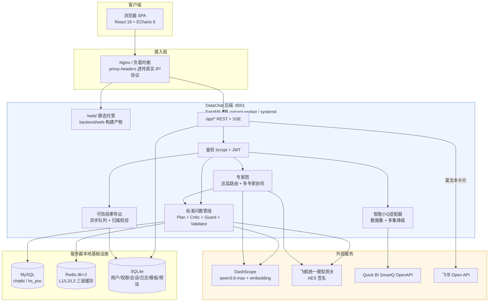
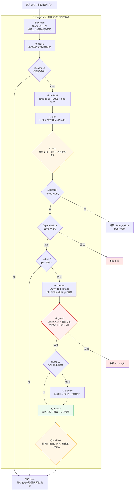
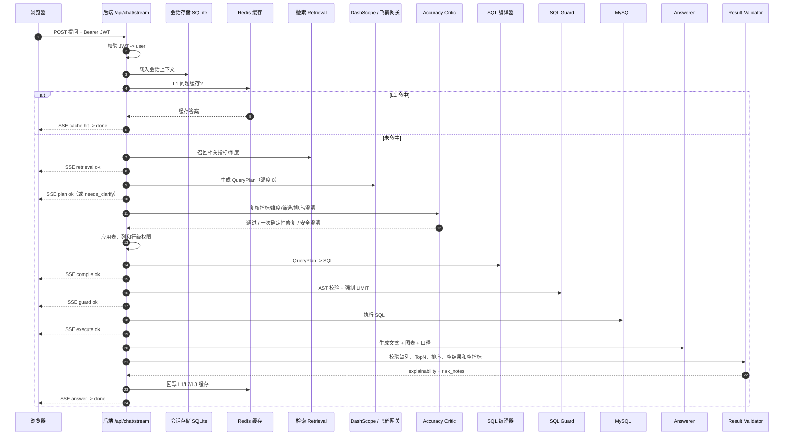
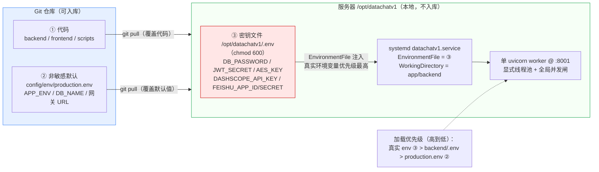
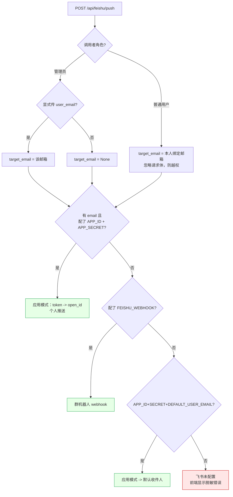

# DataChat · 飞鹤小Q技术架构图

本文用 Mermaid 描述当前 DataChatV1 架构。当前仓库只保留 DataChat 主系统：Python/FastAPI 后端、React 前端、MySQL/Redis/SQLite 存储、受控 NL2SQL、专家团、Quick BI 智能小Q、可信结果导出、LLM 网关与飞书推送。

## ① 系统总览

```mermaid
flowchart TB
    subgraph client["客户端"]
        B["浏览器 SPA<br/>React 18 + ECharts 6"]
    end

    subgraph edge["接入层"]
        LB["Nginx / 负载均衡<br/>proxy-headers 透传真实 IP/协议"]
    end

    subgraph datachat["DataChat 后端 :8001<br/>FastAPI / 单 uvicorn worker / systemd"]
        WEB["/web/ 静态托管<br/>backend/web 构建产物"]
        API["/api/* REST + SSE"]
        AUTH["鉴权 bcrypt + JWT"]
        ORCH["标准问数管线<br/>Plan + Critic + Guard + Validator"]
        EXPERT["专家团<br/>总监路由 + 多专家协同"]
        SMARTQ["智能小Q适配器<br/>数据集 + 多集降级"]
        EXPORT["可信结果导出<br/>异步队列 + 归属校验"]
    end

    subgraph infra["服务器本地基础设施"]
        MYSQL[("MySQL<br/>chatbi / hs_poc")]
        REDIS[("Redis db=2<br/>L1/L2/L3 三层缓存")]
        SQLITE[("SQLite<br/>用户/权限/会话/日志/模板/预设")]
    end

    subgraph ext["外部服务"]
        DS["DashScope<br/>qwen3.6-max + embedding"]
        FEIHE["飞鹤统一模型网关<br/>AES 签名"]
        QBI["Quick BI SmartQ OpenAPI"]
        FS["飞书 Open API"]
    end

    B --> LB --> WEB
    LB --> API
    API --> AUTH
    AUTH --> ORCH
    AUTH --> EXPERT
    AUTH --> SMARTQ
    AUTH --> EXPORT
    EXPERT --> ORCH
    ORCH --> REDIS
    ORCH --> MYSQL
    ORCH --> DS
    ORCH --> FEIHE
    EXPERT --> DS
    EXPERT --> FEIHE
    SMARTQ --> QBI
    API --> SQLITE
    EXPORT --> SQLITE
    API -- "富文本卡片" --> FS

    style datachat fill:#eef5ff,stroke:#3b82f6
    style ext fill:#fff7e6,stroke:#f59e0b
```

| 子系统 | 技术栈 | 端口 | 进程/部署 |
|--------|--------|------|-----------|
| DataChat 后端 | Python 3.11 · FastAPI · uvicorn | 8001 | systemd `datachatv1.service`，单 worker + 显式线程池/并发闸 |
| DataChat 前端 | React 18 · Vite · TS · Tailwind | 无独立端口 | 构建进 `backend/web/`，由后端托管 |

## ② 受控问数管线

一次问数是一条受控阶段管线，逐阶段通过 SSE 实时回推前端。三层缓存命中可短路返回；未命中时必须完成计划复核、权限与 SQL 安全检查，结果在对用户输出前还要做一致性校验。

```mermaid
flowchart TB
    Q["用户提问（自然语言中文）"] --> SESSION

    subgraph pipe["orchestrator.py 每阶段 SSE 回推状态"]
        SESSION["① session<br/>载入多轮上下文<br/>继承上轮指标/维度/筛选"]
        SCOPE["② scope<br/>确定用户可访问数据域"]
        C1{"③ cache L1<br/>问题级命中?"}
        RET["④ retrieval<br/>embedding + BM25 + alias 加权"]
        PLAN["⑤ plan<br/>LLM -> 受控 QueryPlan IR"]
        CRITIC{"⑥ critic<br/>计划复核 + 至多一次确定性修复"}
        CLARIFY{"问题模糊?<br/>needs_clarify"}
        PERM{"⑦ permissions<br/>表/列/行权限"}
        C2{"cache L2<br/>plan 命中?"}
        COMPILE["⑧ compile<br/>确定性 SQL 编译器<br/>同比/环比/占比/TopN/趋势"]
        GUARD{"⑨ guard<br/>sqlglot AST + 表白名单<br/>危险词 + 自动 LIMIT"}
        C3{"cache L3<br/>SQL 结果命中?"}
        EXEC["⑩ execute<br/>MySQL 连接池 + 超时控制"]
        ANS["⑪ answer<br/>业务文案 + 图表 + 口径解释"]
        VALID{"⑫ validate<br/>缺列 / TopN / 排序 / 空结果 / 空指标"}
    end

    SESSION --> SCOPE --> C1
    C1 -- "hit" --> OUT
    C1 -- "miss" --> RET --> PLAN --> CRITIC --> CLARIFY
    CLARIFY -- "是" --> ASK["返回 clarify_options<br/>请用户澄清"]
    CLARIFY -- "否" --> PERM
    PERM -- "无权" --> DENY["权限不足"]
    PERM -- "有权" --> C2
    C2 -- "hit" --> OUT
    C2 -- "miss" --> COMPILE --> GUARD
    GUARD -- "拒绝" --> REJECT["拦截 + trace_id"]
    GUARD -- "通过" --> C3
    C3 -- "hit" --> ANS
    C3 -- "miss" --> EXEC --> ANS
    ANS --> VALID
    VALID --> OUT["SSE done<br/>前端渲染卡片/图表/风险提示"]

    style GUARD fill:#fff0f0,stroke:#cc0000
    style CRITIC fill:#fff7e6,stroke:#f59e0b
    style VALID fill:#fff7e6,stroke:#f59e0b
    style ANS fill:#eefbef,stroke:#16a34a
    style REJECT fill:#ffe6e6
    style DENY fill:#ffe6e6
```

## ③ 问数请求时序

```mermaid
sequenceDiagram
    autonumber
    participant U as 浏览器
    participant API as 后端 /api/chat/stream
    participant CV as 会话存储 SQLite
    participant R as Redis 缓存
    participant RT as 检索 Retrieval
    participant LLM as DashScope / 飞鹤网关
    participant CR as Accuracy Critic
    participant CP as SQL 编译器
    participant G as SQL Guard
    participant DB as MySQL
    participant AN as Answerer
    participant VR as Result Validator

    U->>API: POST 提问 + Bearer JWT
    API->>API: 校验 JWT -> user
    API->>CV: 载入会话上下文
    API->>R: L1 问题缓存?
    alt L1 命中
        R-->>API: 缓存答案
        API-->>U: SSE cache hit -> done
    else 未命中
        API->>RT: 召回相关指标/维度
        API-->>U: SSE retrieval ok
        API->>LLM: 生成 QueryPlan（温度 0）
        API-->>U: SSE plan ok（或 needs_clarify）
        API->>CR: 复核指标/维度/筛选/排序/澄清
        CR-->>API: 通过 / 一次确定性修复 / 安全澄清
        API->>API: 应用表、列和行级权限
        API->>CP: QueryPlan -> SQL
        API-->>U: SSE compile ok
        API->>G: AST 校验 + 强制 LIMIT
        API-->>U: SSE guard ok
        API->>DB: 执行 SQL
        API-->>U: SSE execute ok
        API->>AN: 生成文案 + 图表 + 口径
        API->>VR: 校验缺列、TopN、排序、空结果和空指标
        VR-->>API: explainability + risk_notes
        API->>R: 回写 L1/L2/L3 缓存
        API-->>U: SSE answer -> done
    end
```

## ④ 配置分层与部署边界

Git 只承载代码和零密钥默认值；所有密钥只在服务器本地第三层，`git pull` 部署不覆盖、优先级最高。

```mermaid
flowchart LR
    subgraph git["Git 仓库（可入库）"]
        direction TB
        CODE["① 代码<br/>backend / frontend / scripts"]
        DEF["② 非敏感默认<br/>config/env/production.env<br/>APP_ENV / DB_NAME / 网关 URL"]
    end

    subgraph server["服务器 /opt/datachatv1（本地，不入库）"]
        direction TB
        SEC["③ 密钥文件 /opt/datachatv1/.env（chmod 600）<br/>DB_PASSWORD / JWT_SECRET / AES_KEY<br/>DASHSCOPE_API_KEY / FEISHU_APP_ID/SECRET"]
        SVC["systemd datachatv1.service<br/>EnvironmentFile = ③<br/>WorkingDirectory = app/backend"]
        RUN["单 uvicorn worker @ :8001<br/>显式线程池 + 全局并发闸"]
    end

    CODE -- "git pull（覆盖代码）" --> server
    DEF -- "git pull（覆盖默认值）" --> server
    SEC -- "EnvironmentFile 注入<br/>真实环境变量优先级最高" --> SVC --> RUN

    NOTE["加载优先级（高到低）：<br/>真实 env ③ > backend/.env > production.env ②"]
    NOTE -.-> RUN

    style git fill:#e6f0ff,stroke:#3b82f6
    style SEC fill:#ffe6e6,stroke:#cc0000
    style server fill:#f6fff6,stroke:#16a34a
```

红线：密钥只能进第三层；第二层 `production.env` 会被部署覆盖且入库，严禁写任何密钥。

## ⑤ 飞书推送路由

```mermaid
flowchart TB
    START["POST /api/feishu/push"] --> ROLE{"调用者角色?"}
    ROLE -- "管理员" --> ADM{"显式传 user_email?"}
    ADM -- "是" --> TGT["target_email = 该邮箱"]
    ADM -- "否" --> NONE["target_email = None"]
    ROLE -- "普通用户" --> USR["target_email = 本人绑定邮箱<br/>忽略请求体，防越权"]

    TGT --> R1
    USR --> R1
    NONE --> R1

    R1{"有 email 且<br/>配了 APP_ID + APP_SECRET?"}
    R1 -- "是" --> APP["应用模式：token -> open_id<br/>个人推送"]
    R1 -- "否" --> R2{"配了 FEISHU_WEBHOOK?"}
    R2 -- "是" --> HOOK["群机器人 webhook"]
    R2 -- "否" --> R3{"APP_ID+SECRET+DEFAULT_USER_EMAIL?"}
    R3 -- "是" --> DEF2["应用模式 -> 默认收件人"]
    R3 -- "否" --> ERR["飞书未配置<br/>前端显示脱敏错误"]

    style ERR fill:#ffe6e6,stroke:#cc0000
    style APP fill:#e6ffe6,stroke:#16a34a
    style HOOK fill:#e6ffe6,stroke:#16a34a
    style DEF2 fill:#e6ffe6,stroke:#16a34a
```

## 技术栈一览

| 层 | 选型 |
|----|------|
| 前端 | React 18 · Vite 5 · TypeScript 5 · TailwindCSS 3 · ECharts 6 · framer-motion |
| 后端 | Python 3.11 · FastAPI · uvicorn · Pydantic · httpx · sqlglot · PyMySQL · bcrypt · PyJWT |
| 检索/NL2SQL | DashScope embedding(text-embedding-v3) · BM25 · Plan-First IR · 确定性 SQL 编译器 |
| 准确率治理 | Accuracy Critic · Result Validator · 基准问题集 · 多轮链路回归 |
| 分析能力 | 标准问数 · 决策专家团 · Quick BI 智能小Q · Excel 导出 · DOCX 报告 |
| 存储 | MySQL 8（业务库）· Redis（三层缓存）· SQLite（用户/权限/会话/日志/模板/预设） |
| LLM | 阿里百炼 DashScope / 飞鹤统一网关（AES 签名，可多预设热切换） |
| 部署 | 单 Uvicorn worker · 显式线程池/并发闸 · systemd · Nginx/LB · Redis · k6 |
| 安全 | JWT 鉴权 · 仅 SELECT · sqlglot AST 护栏 · 表白名单 · 自动 LIMIT · 按 user_id 数据权限 · 密钥服务器本地 chmod 600 |
